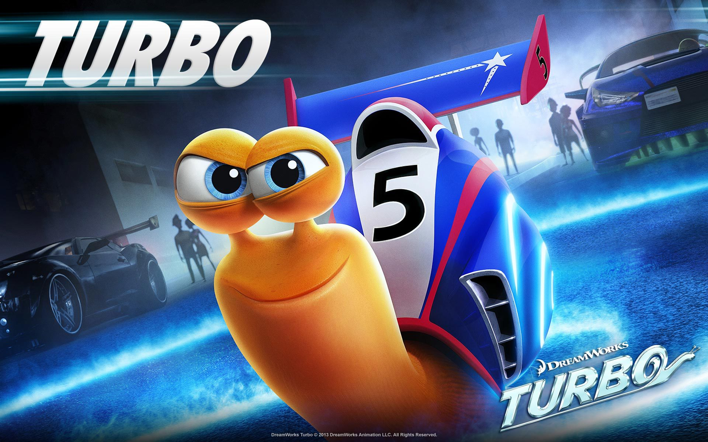
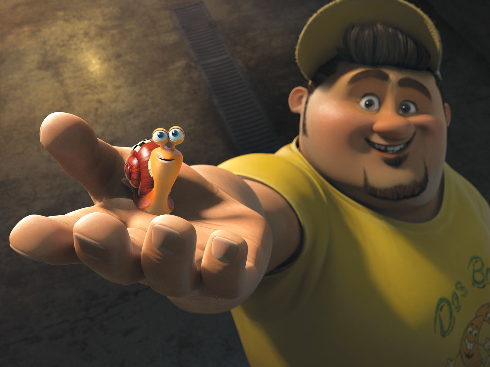
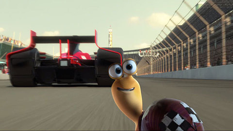

<!DOCTYPE html>

<html>
	<head>
		<title>CSS Responsive</title>
		<link rel="stylesheet" href="views/style.css">
	</head>

	<body>
		<header id="top" class="grid">
			

			

			<h1>Turbo (Ryan Reynolds)-2013</h1>
			

				Turbo (Ryan Reynolds) is a speed-obsessed snail with an unusual dream: to become the world's greatest racer. This odd snail gets a chance to leave his slow-paced life behind when a freak accident gives him the power of superspeed.
			

			<a href="#sec-c" class="btn">Gallery</a>
			
			

		</header>
		 

		<section id="sec-a" class="grid">
			

				<h2 class="review">Critic Reviews & Public Reactions</h2>
				

					

						"This is one of the best movies of the decade, showing the emotion that comes with being a human, and the vulnerability of being a man. In this thriller, we meet our young hero, Tyson. As he walks the fields of his home, he encounters a blue snail. He decides to take him home, only to release him shortly after. As he awakes in the middle of the night, he sees that snails are entering his home, only to turn him into a snail."
					

				

			

		</section>
		
		 
		<section id="sec-c" class="grid">
			<ul>
				<li>
					

						
						

							<h3 class="card-title">Turbo</h3>
							

								This is one of the best movies of the decade, showing the emotion that comes with being a human, and the vulnerability of being a man.
							

							
						

					

				</li>
				<li>
					

						
						<h3 class="card-title">Turbo</h3>
						

							This is one of the best movies of the decade, showing the emotion that comes with being a human, and the vulnerability of being a man.
						

						
					

					
				</li>
				<li>
					

						
						<h3 class="card-title">Turbo</h3>
						

							This is one of the best movies of the decade, showing the emotion that comes with being a human, and the vulnerability of being a man.
						

						
					

					
				</li>
			</ul>
			
		</section>
		 
		<section id="sec-d" class="grid">
			<h2 class="about">About the movie</h2>
				

					

						Along with his streetwise snail crew and new human friends, Turbo, an underdog snail, takes on the biggest challenge ever to make their dreams come true.
					

		</section>
		 
		<section id="sec-e" class="grid2">
			

			<h2 class="contact-text">Contact Maker</h2>
			

				Thanks to movies like Shrek, Trolls, Kung-Fu Panda, How to Train Your Dragon, Madagascar, and The Boss Baby, and television series like Trollhunters, Spirit Riding Free, and All Hail King Julien, DreamWorks Animation is recognized across the globe as a leader in quality family entertainment.
			

			

			

			<h2 class="about-maker">About Maker</h2>
			

				Thanks to movies like Shrek, Trolls, Kung-Fu Panda, How to Train Your Dragon, Madagascar, and The Boss Baby, and television series like Trollhunters, Spirit Riding Free, and All Hail King Julien, DreamWorks Animation is recognized across the globe as a leader in quality family entertainment.
			

			

		</section>
		 
		 
		

			

				Project by Md Hasibur Rahman Tomal @copyright2020
			

		

	</body>
</html>
